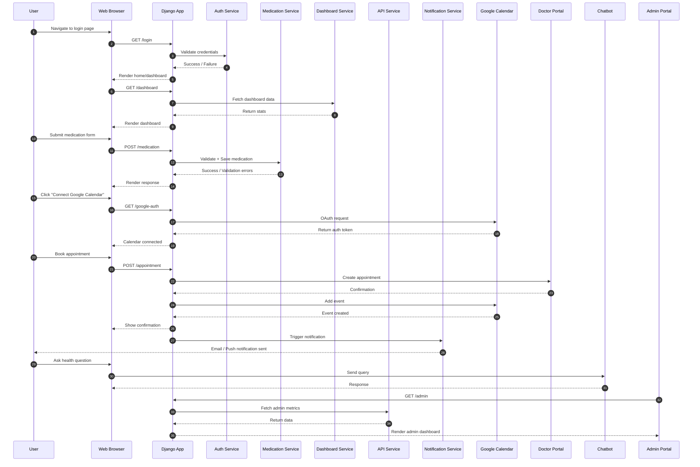
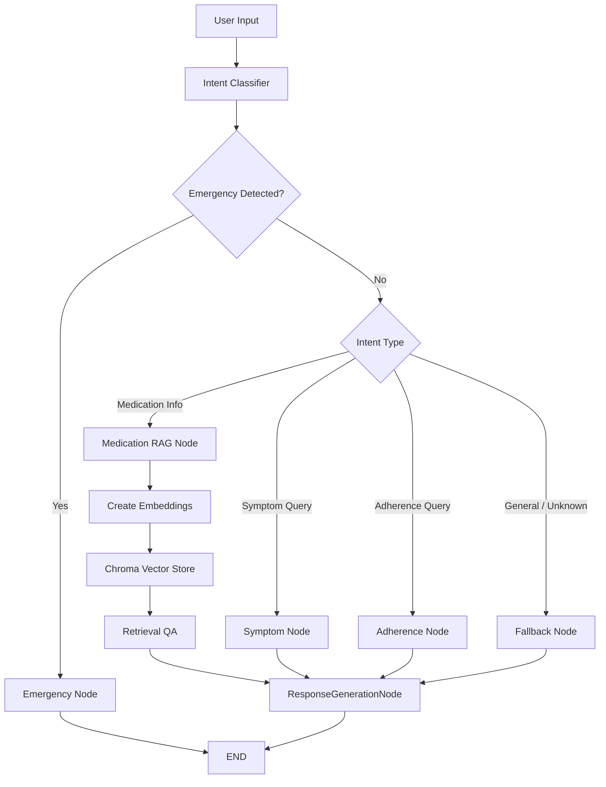

## 🏥 Project Overview

Many patients, especially those with chronic conditions, struggle with medication adherence. Forgetting doses or confusing schedules can lead to serious health risks. Existing solutions often lack personalization, proactive reminders, and intuitive user interfaces.

**MediMimes** fills this gap by combining:

- A user‑friendly medication scheduler   
- An interactive rag-based health chatbot assistant  

It not only reminds users to take medicines, but also conversational support. //improve this line

---
## Team Members

- **Pragya Bansal (20243208)** — https://github.com/PragyaBansal12 
- **Aadya (20243001)** — https://github.com/aadya75  
- **Naina (20243172)** — https://github.com/nainaamodii

---

## Tech Stack

- **Backend / Web Framework**: Django  
- **Authentication**: django-allauth, Google-auth 
- **Database**: SQLite3 (via Django ORM)  
- **Scheduling / Reminders**: APScheduler , Django backgroud tasks 
- **Browser Push Notifications**: pywebpush  
- **Google Calendar / OAuth**: google-api-python-client, google-auth, google-auth-oauthlib  
- **Data Processing / ML**: pandas, numpy, scikit-learn  
- **Chatbot**: langchain, langgraph  
- **Visualization**: Plotly  
- **Frontend / UI**: Bootstrap 
---
## Features

###  Robust Authentication System
- User registration and login  
- Secure session handling with Django authentication  
- Password hashing and admin management via Django Admin
- Multi-role login - patient, doctor and admin

### Patient Side Features 
- Personalized patient dashboard showing medication logs, upcoming appointments, and health activity
- Medication Management: Add daily medications, track intake history, receive reminders
- Appointment booking: View available doctors, book appointments
- Integrated Chatbot: Ai-powered smptom assistnace using LangGraph, Medicatoin informatoin via RAG (PDF knowledge base), safe, non-prescriptive general health guidance
- Notification system: Email alerts for medication schedules, appointment reminders, system-wide updates
- Profile and health data management

### Doctor Side Features
- Dedicated doctor dashboard
- View patient appointments
- Mark appointments as complete
- Update availability and time slots
- Access patient medication entries
- Approve or review patient reports
- Receive automatic notifications for new bookings

### Admin Portal Features
- Full access to system analytics
- Manage patients and dcotrs accounts
- View system-wide activity dashboard

### Appointment Management System
- Book appointments with available doctors
- Accept or cancel request on doctor side

### Notification service
- Medication alerts on web browser

### AI Chatbot (LangGraph + RAG)
- Intent classifier to route medical queries
- Safety nodes: Red Flag and Emergency Detector
- Symptom analysis (non-diagnostic)
- Medication information from structured PDF datasets
- Fallback and repair nodes for unclear queries
- Fast retrieval using Chroma vector search
- Strict safety compliance (non-prescriptive, no dosing advice)

### Google Calendar Integration
- OAuth-based secure calendar linking
- Auto-create events for docot appointments
- Sync reminders across devices

---

###  RAG Based Chatbot
- Built using LangGraph with a structured, multi-node conversational workflow.
- Includes a deterministic safety layer with Red Flag and Emergency nodes to detect critical symptoms.
- Uses an Intent Classifier to route queries to the correct medical-information node.
- Handles symptom queries via a non-prescriptive Symptom Node that provides safe, general guidance.
- Provides medication information through a RAG-powered Medication Node using PDF documents, embeddings, and Chroma vector search.
- Supports adherence and general medication understanding via an Adherence Node.
- Includes a Fallback Node for unclear queries to maintain reliability and reduce hallucinations.
- Maintains stateful, controlled conversation flow across all nodes for consistency and safety.

---

###  Live Chat Interface
- Smooth real-time chatbot UI  
- Typing indicators with streaming responses  
- Mobile-responsive design  

---
###  Data Management
- User profile section  
- Query history logs (optional)  
- Admin controls for uploading medical PDFs  
- SQLite-backed persistent storage  

---

###  Knowledge Blog (Optional Module)
- Public health-awareness article hub  
- Markdown-based editor  
- Django-admin moderation  

---
###  Session Management
- Django session-based login  
- Auto-logout after session expiry  

---

##  Process Flow

1. **User Authentication**  
   - User signs up / logs in  
2. **Medication Schedule Setup**  
   - Input pill name, dosage, time, frequency  
   - Stored in backend, synced with Google Calendar  
3. **Dashboard View**  
   - Shows upcoming doses, adherence history, medication schedule
4. **Reminder Notifications**  
   - At scheduled times, sends notification 
   - Buttons: “Taken” / “Missed”  
5. **Logging Dose Status**  
   - **Taken**:
     - Record status in DB  
     - Update calendar event  
     - Refresh dashboard graphs  
   - **Missed**:
     - Record status  
     - Update calendar event  
     - AI model analyzes for pattern  
     - Trigger proactive reminders if risk detected  
6. **AI Modules**    
   - **Chatbot Assistant**: natural language safe queries (personal data / medication related / general education / symptom logging / adherence tracking)  
7. **Visualization Dashboard**  
   - Graphs: adherence rates, missed doses, long‑term trends  
   - Insights into user behavior  
8. **Google Calendar Integration**  
   - Create events for doses  
   - Auto‑update if doses missed/rescheduled  

---
### Database Schema

---

---

### Installation

---

### AI/ML Integration Details

---
### Future Improvements

- adding session memory to chatbot
- multi-intent messages in chatbot 
- critical notifications choice for patient for nudge notifications 
-map based doctor recommendation system
-trend analysis for patient in dashboard (present in chatbot)
-payment gateway for appointment and premium feature access

